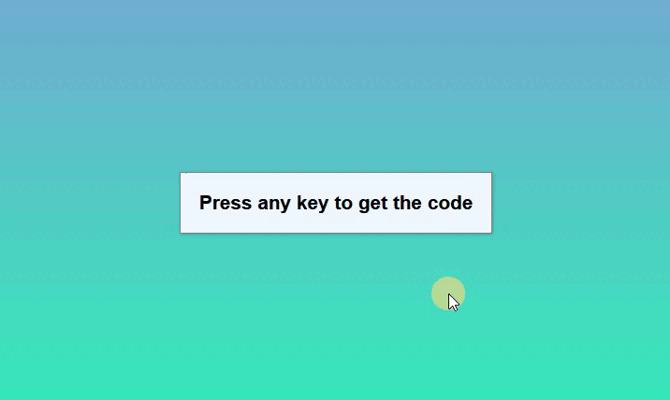

# 🛠 JAVASCRIPT event key codes

# 🔗 [Live Preview](https://632f774146da455f62533ec8--boisterous-crepe-aa33c7.netlify.app/)

## Welcome! 👋

- In this project, I learn how to make an event listener so that when any key on a keyboard is pressed, I get information about the pressed key. Not sure where this would be useful but it was a fun practice.

### Languages and features 👨‍💻 

- JS: DOM manipulation.

Thanks for checking out my projects.

